<div align="center">
  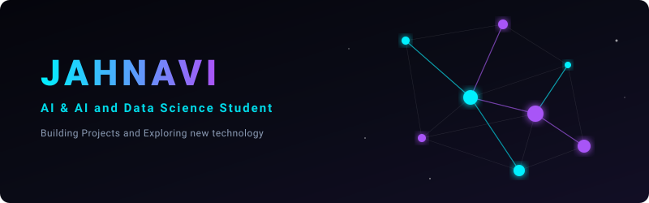
</div>

<br />

<!-- ==================== HERO SECTION ==================== -->
<table width="100%" border="0" cellpadding="10" cellspacing="0">
  <tr>
    <td width="58%" valign="middle">
      <p><code>PROFILE.SYSTEM // ONLINE</code> • <code>SYS.STATUS: NOMINAL ●</code></p>
      <h1>HELLO, I'M <span style="color:#00f0ff;">KANDULA JAHNAVI</span></h1>
      <h3><code>Artificial Intelligence &amp; Data Science Undergraduate</code></h3>
      <p>
        🏛️ <strong>BMS College of Engineering (BMSCE)</strong><br />
        📍 <strong>Bengaluru, India</strong> &nbsp;•&nbsp; 🎓 <em>3rd Year B.E. (Graduating 2028)</em>
      </p>
      <p>
        <em>"Exploring intelligence through data, computational models, and real-world technology to bridge analytical algorithms with practical human experiences."</em>
      </p>
      <p>
        
        
        
      </p>
    </td>
    <td width="42%" align="center" valign="middle">
      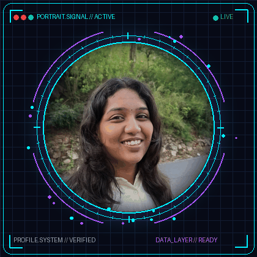
    </td>
  </tr>
</table>

<br />

<!-- ==================== LIVE AI TERMINAL ==================== -->
<div align="center">
  
</div>

<br />

<!-- ==================== MOVING ML TRAINING & NEURAL COMPUTATION ==================== -->
<table width="100%" border="0" cellpadding="6" cellspacing="0">
  <tr>
    <td width="50%" align="center" valign="top">
      
    </td>
    <td width="50%" align="center" valign="top">
      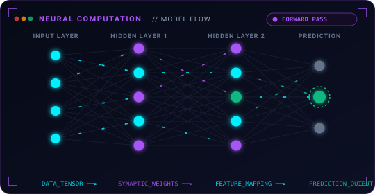
    </td>
  </tr>
</table>

<br />

<!-- ==================== ABOUT ME SECTION ==================== -->
## 📡 `ABOUT_ME.exe` // SYSTEM OVERVIEW

```yaml
system_profile:
  developer: "Kandula Jahnavi"
  academic_standing: "3rd Year B.E. Student"
  institution: "BMS College of Engineering (BMSCE)"
  specialization: "Artificial Intelligence & Data Science"
  base_location: "Bengaluru, Karnataka, India"
  
core_interests:
  - "Machine Learning & Predictive Modeling"
  - "Data Science & Analytical Problem Solving"
  - "Computer Vision & Spatial Interaction"
  - "Building Practical, High-Impact Technology Systems"
  - "Continuous Learning & Model Experimentation"

operating_philosophy:
  mindset: "Curious • Technical • Builder • Ambitious"
  motto: "Transforming raw data and mathematical principles into practical intelligent tools."
  status: "CONSTANTLY LEARNING ●"
```

<br />

<!-- ==================== EDUCATION SECTION ==================== -->
## 🎓 `EDUCATION.sys` // ACADEMIC TIMELINE

<div align="center">
  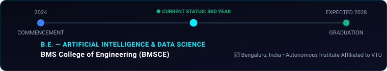
</div>

<br />

<!-- ==================== TECH STACK SECTION ==================== -->
## 🛠️ `TECH_STACK.env` // VERIFIED TECHNICAL TOOLKIT

<div align="center">
  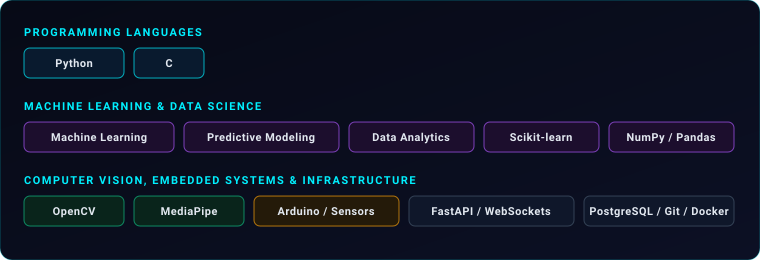
</div>

<br />

<!-- ==================== FEATURED PINNED PROJECTS ==================== -->
## 🚀 `FEATURED_PROJECTS.dir` // PINNED REPOSITORIES

<table width="100%" border="0" cellpadding="10" cellspacing="0">
  <tr>
    <!-- Project 1: AI Maritime Risk Intelligence -->
    <td width="50%" valign="top">
      <div align="center">
        <a href="https://github.com/Kathyayini26/AI-Maritime-Risk-Intelligence">
          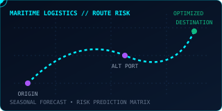
        </a>
      </div>
      <h3><a href="https://github.com/Kathyayini26/AI-Maritime-Risk-Intelligence">🚢 AI-Maritime-Risk-Intelligence</a></h3>
      <p>
        AI-powered Maritime Logistics Intelligence Platform for route risk prediction, seasonal forecasting, alternative port optimization, interactive mapping, and logistics analytics using Machine Learning and Python.
      </p>
      <p>
        <code>Machine Learning</code> • <code>Python</code> • <code>Flask</code> • <code>Risk Prediction</code> • <code>Logistics Analytics</code>
      </p>
      <p>
        <a href="https://github.com/Kathyayini26/AI-Maritime-Risk-Intelligence"><strong>→ View Repository</strong></a>
      </p>
    </td>
    <!-- Project 2: Smart Attendance & Timetable Generator -->
    <td width="50%" valign="top">
      <div align="center">
        <a href="https://github.com/Kathyayini26/Smart-Attendence-and-Timetable-generator">
          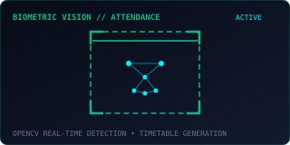
        </a>
      </div>
      <h3><a href="https://github.com/Kathyayini26/Smart-Attendence-and-Timetable-generator">📷 Smart-Attendence-and-Timetable-generator</a></h3>
      <p>
        Automated biometric attendance recognition and intelligent timetable scheduling system powered by computer vision and Python algorithms.
      </p>
      <p>
        <code>Python</code> • <code>OpenCV</code> • <code>Computer Vision</code> • <code>Automation</code>
      </p>
      <p>
        <a href="https://github.com/Kathyayini26/Smart-Attendence-and-Timetable-generator"><strong>→ View Repository</strong></a>
      </p>
    </td>
  </tr>
  <tr>
    <!-- Project 3: SMARTCANE -->
    <td width="50%" valign="top">
      <div align="center">
        <a href="https://github.com/Kathyayini26/SMARTCANE">
          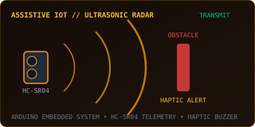
        </a>
      </div>
      <h3><a href="https://github.com/Kathyayini26/SMARTCANE">🦯 SMARTCANE</a></h3>
      <p>
        Assistive navigation hardware platform for visually impaired individuals utilizing ultrasonic distance telemetry, buzzer haptics, and microcontroller processing.
      </p>
      <p>
        <code>C++</code> • <code>Arduino</code> • <code>HC-SR04 Sensors</code> • <code>Embedded Systems</code> • <code>IoT</code>
      </p>
      <p>
        <a href="https://github.com/Kathyayini26/SMARTCANE"><strong>→ View Repository</strong></a>
      </p>
    </td>
    <!-- Project 4: AIRSPACE -->
    <td width="50%" valign="top">
      <div align="center">
        <a href="https://github.com/jahnavik1125/AIRSPACE">
          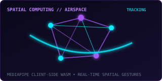
        </a>
      </div>
      <h3><a href="https://github.com/jahnavik1125/AIRSPACE">✨ AIRSPACE</a></h3>
      <p>
        Touchless Spatial Human-Computer Interaction Platform transforming camera feeds into an intuitive creative canvas via real-time client-side gesture telemetry.
      </p>
      <p>
        <code>TypeScript</code> • <code>Computer Vision</code> • <code>MediaPipe WASM</code> • <code>Spatial Computing</code>
      </p>
      <p>
        <a href="https://github.com/jahnavik1125/AIRSPACE"><strong>→ View Repository</strong></a>
      </p>
    </td>
  </tr>
</table>

<br />

<!-- ==================== CURRENTLY LEARNING PIPELINE ==================== -->
## 🔄 `LEARNING_CYCLE.pipeline` // CONTINUOUS EVOLUTION

<div align="center">
   Learning -> Experimenting -> Building -> Deploying" width="100%" />
</div>

<br />

<!-- ==================== GITHUB ACTIVITY ==================== -->
## 📊 `ACTIVITY_TELEMETRY.hub` // LIVE GITHUB ACTIVITY

<div align="center">
  
  &nbsp;
  
</div>

<br />

<!-- ==================== CONNECT WITH ME ==================== -->
## 🌐 `SYSTEM_CONNECT.io` // REACH OUT

<div align="center">
  <p><strong>Open to discussions on Machine Learning, Computer Vision, Data Science, and technology collaborations.</strong></p>
  
  <a href="https://github.com/jahnavik1125">
    
  </a>
  &nbsp;
  <a href="mailto:kandulajahnavi.ad24@bmsce.ac.in">
    
  </a>
  &nbsp;
  <a href="https://linkedin.com">
    
  </a>

  <br /><br />
  <p><code>PROFILE.SYSTEM // VERIFIED // BMSCE AI &amp; DS 2028</code></p>
</div>
